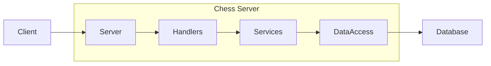

# Notes

Project notes for CS 240

## Chess Project Structure

`ChessPosition`: this class represents a position on a chess board, from 1-8. It is used for all representations on the
chess board--for instance, when a piece moves, its movement will be represented by a change in positions, from one to
another.

`ChessMove`: this class represents the movement of pieces on the chessboard. Each object consists of two ChessPositions,
one which signifies the start position, and another the end. It also contains any promotional pieces involved in the
movement.

`ChessPiece`: this class represents a single piece, which has a team color (black/white) and a type (bishop, king, etc.
represented by an enum). It also contains code for calculating what eligible moves for a piece are. Note that a piece
does NOT track its own position. Moves and positions are handled separately.

`ChessBoard`: This contains the board. It has a 2 dimensional array that represents the board, with 8 indices for rows
and columns. This has method to add pieces at specific ChessPositions, get the piece at a specific ChessPosition, and
reset the board.

## OOP Principles

In OOP, we want to solve a problem and abstract things. This is so that we hide any uneeded details and make our code open to modification and addition.

**Encapsulation**: placing fields and methods in classes. Restricting access to some components using `private`, with
getter/setter methods to manipulate fields. You hide details that don't matter.

**Abstraction**: hiding complex internal details from the user, showing them essential functionality that they need. A
focus on what something does instead of how. For car, for instance, you do not need to know how the calipers or brakes work. You just need to know how to use the gas, break, and wheel. This is providing the right details that matter.

**Inheritance**: allowing a class to adopt properties of another, creating a hierarchical, superclass to subclass
relationship. Subclasses gain non-private fields/methods from superclasses, and can expand with more features or
override features from its superclass. This allows you to add code.

**Polymorphism**: allowing "objects of different types to be treated as objects of a common superclass." A uniform interface allows for consistent interactions with these objects.

- Static Polymorphism (Method Overloading): multiple methods in the same class having the same name, but are defined with different parameters
- Dynamic Polymorphism (Method Overriding): subclass provides a specific implementation of a method defined by a superclass or an interface.

## [Architectural Patterns](https://masteryls.com/course/7b46ce1a-2b79-4455-b706-aea79f1b51ac/topic/4419212e-ba5e-4298-86db-3b3374243973)

Polymorphism Again: By creating a common interface, each object under that interface can be treated the same.

Single Responsibility Rule (SRP): each class has one responsibility, and only one reason to change.

### Decoupling Rules from Entities

We want to avoid creating "fat entities". We do not want to couple a class's identity with, say, our game rules.

# Phase 2 Notes

## Components

- Client: What the user uses to play the game of chess.
- Server: receives network requests from client. Also handles all unhandled exceptions, being closes to the client.
- Handlers: gets information from server, deserializes information into objects. Calls service methods to send objects.
- Services: processes logic. Receives data objects from Handlers, then executes proper logic to accomplish what is needed. calls DAOs
  - these classes implement functionality for server. It is the logic associated with endpionts.
  - simple implementation: separate service class for each group of related endpoints, such as UserService.
- Data Access: called by Services to manipulate database data.
- Database: persistent data storage.

## API Endpoints

API endpoints are used to communicate from client to server.

- Clear: clear database--all users, games, authTokens
  - URL: `/db`
  - HTTP Method: `DELETE`
  - Success response: `[200]{}`
  - Failure Response: `[500]{ "message": "Error: (description of error)" }`
- Register: register new user
  - URL: `/user`
  - HTTP Method: `POST`
  - Body: `{ "username":"", "password":"", "email":"" }`
  - Success response: `[200]{ "username":"", "authToken":"" }`
  - Failure Response: `[400]{ "message": "Error: bad request" }`
  - Failure Response: `[403]{ "message": "Error: already taken" }`
  - Failure Response: `[500]{ "message": "Error: (description of error)" }`
- Login: login existing user (returns new authToken)
  - URL: `/session`
  - HTTP Method: `POST`
  - Body: `{ "username":"", "password":"" }`
  - Success response: `[200]{ "username":"", "authToken":"" }`
  - Failure Response: `[400]{ "message": "Error: bad request" }`
  - Failure Response: `[401]{ "message": "Error: unauthorized" }`
  - Failure Response: `[500]{ "message": "Error: (description of error)" }`
- Logout: log out user represented by provided authToken
  - URL: `/session`
  - HTTP Method: `DELETE`
  - Headers: `authorization: <authToken>`
  - Success response: `[200]{}`
  - Failure Response: `[401]{ "message": "Error: unauthorized" }`
  - Failure Response: `[500]{ "message": "Error: (description of error)" }`
- List Games: verifies provided authToken, gives list of all games. Note: `whiteUsername` and `blackUsername` may be `null`.
  - URL: `/game`
  - HTTP Method: `GET`
  - Headers: `authorization: <authToken>`
  - Success response: `[200] { "games": [{"gameID": 1234, "whiteUsername":"", "blackUsername":"", "gameName:""} ]}`
  - Failure Response: `[401] { "message": "Error: unauthorized" }`
  - Failure Response: `[500]{ "message": "Error: (description of error)" }`
- Create Game: verifies provided authToken, creates new game
  - URL: `/game`
  - HTTP Method: `POST`
  - Headers: `authorization: <authToken>`
  - Body: `{ "gameName":"" }`
  - Success response: `[200] { "gameID": 1234 }`
  - Failure response: `[400] { "message": "Error: bad request" }`
  - Failure response: `[401] { "message": "Error: unauthorized" }`
  - Failure Response: `[500]{ "message": "Error: (description of error)" }`
- Join Game: verifies provided authToken. Checks that the game exists, then add caller as requested color to the game.
  - URL: `/game`
  - HTTP Method: `PUT`
  - Headers: `authorization: <authToken>`
  - Body: `{ "playerColor":"WHITE/BLACK", "gameID": 1234 }`
  - Success response: `[200]{}`
  - Failure response: `[400] { "message": "Error: bad request" }`
  - Failure response: `[401] { "message": "Error: unauthorized" }`
  - Failure response: `[403] { "message": "Error: already taken" }`
  - Failure Response: `[500]{ "message": "Error: (description of error)" }`

## Data Model Classes

Represents various types of data as Java Objects. Data sent via endpoints are converted to these objects by the handler.

- UserData: user is registered and authenticated as a player/observer in application.
  - username (`String`)
  - password (`String`)
  - email (`String`)
- AuthData: association of username and auth token that represents that the user has previously been authorized to use the application.
  - authToken (`String`)
  - username (`String`)
- GameData: information about game state. Players, board, current state.
  - gameID (`int`)
  - whiteUsername (`String`)
  - blackUsername (`String`)
  - gameName (`String`)
  - game (`ChessGame`)

## DataAccess Classes

These access your database and are known as Data Access Objects (DAOs), within the DataAccess package. They are responsible for storing, retrieving server's data.

DAO methods will be CRUD operations:

- Create objects in data store
- Read objects from data store
- Update objects already in data store
- Delete objects from data store.

Often, parameters and return values of DAO methods will be model objects.

Examples:

- clear: deleting all data from database
- createUser
- getUser
- createGame
- getGame
- listGames
- updateGames
- createAuth
- getAuth
- deleteAuth

DataAccess Interface should be implemented (abstraction).

## Other terms

- authToken: a randomized string of characters representing that a user has been authenticated with their username and password. THIS JUST MEANS THAT A USER IS LOGGED IN. This is created when a user registers or logs in, and is stored in an AuthData object, associating username to token.
  - register and login endpoints return authToken in body of responses.
  - list games endpoint provides authToken in http auth header.

## Endpoint logic

The specific logic flow needed for each endpoint.

- Clear: clear database. Remove all users, games, authTokens.
- Register:
- Login
- Logout
- List Games
- Create Game
- Join Game

## Class Structure

To facilitate the creation of the sequence diagram, this is a basic class structure, based on the provided diagram and example code in Phase 2/3

Exceptions are not yet considered.

- Client: calls server endpoints. Receives HTTP responses from server.
- Server: called by client. handles exceptions, passes information to the handler.
  - Clear
  - Register
  - Login
  - Logout
  - List Games
  - Create Game
  - Join Game
- Handlers class. Takes json data from server, converts to objects. calls service methods. Receives results from service.
  - convert request to objects/data
    - convertClear
    - convertRegister
    - convertLogin
- Service Classes: handles logic via calling DAO methods.
  - `UserService`: handles logic for user related requests
    - `RegisterResult register(RegisterRequest)`: register a user.
      - Determines if the user exists. If they do not, register them by placing their UserData in the database. It creates an authToken and then adds this to the database via an AuthData object. DAO calls:
        - `getUser`
        - `createUser`
        - `createAuth`
      - `RegisterRequest`: record class that contains username, password, email fields.
      - `RegisterResult`: record class contains username, authToken
    - `LoginResult login(LoginRequest)`: logs in a user.
      - Determine if a user already exists. If they do, log them in by verifying their credentials and creating an authToken for them.
        - `getUser`: get user data
        - `createAuth`: create the auth data after authentication of UserData.
      - `LoginRequest`: record class contains username, password.
      - `LoginResult`: record class contains username, authToken
    - `LogoutResult logout(LogoutRequest)`: logout the user by clearing their authToken.
      - delete a user's authToken, thus logging them out.
        - getAuth: get auth Data associated with authToken.
        - deleteAuth: delete auth data.
      - `LogoutRequest`: record class for a logout request, containing authToken.
      - `LogoutResult`: record class for a logout request. largely empty, or void, or containing a boolean.
  - `GameService`: handles logic for game related requests
    - `listGames`
    - `createGame`
    - `joinGame`
  - `StorageService`: handles logic for storage related requests
- DataAccess Classes: manipulates database. All methods throws DataAccessException or a child of. split auth/user?
  - `UserDAO`: handles data access for user related requests
    - `UserData getUser(username)`: get UserData object associated with the username.
    - `void createUser(UserData)`: create a user, add UserData to database.
    - `void createAuth(authData)`: add authData to database
    - `AuthData getAuth(authToken)`: get associated AuthData from authToken.
    - `void deleteAuth(AuthData)`: remove this authData from db.
  - `GameDAO`: handles data access for game related requests
  - `StorageDAO`: handles data access for storage management reasons.
    - `void removeUsers()`: remove all users.
    - `void removeGames()`: remove all games.
    - `void removeAuthTokens()`: remove all authTokens
- Data Classes:
  - UserData: user is registered and authenticated as a player/observer in application.
    - username (`String`)
    - password (`String`)
    - email (`String`)
  - AuthData: association of username and auth token that represents that the user has previously been authorized to use the application.
    - authToken (`String`)
    - username (`String`)
  - GameData: information about game state. Players, board, current state.
    - gameID (`int`)
    - whiteUsername (`String`)
    - blackUsername (`String`)
    - gameName (`String`)
    - game (`ChessGame`)
